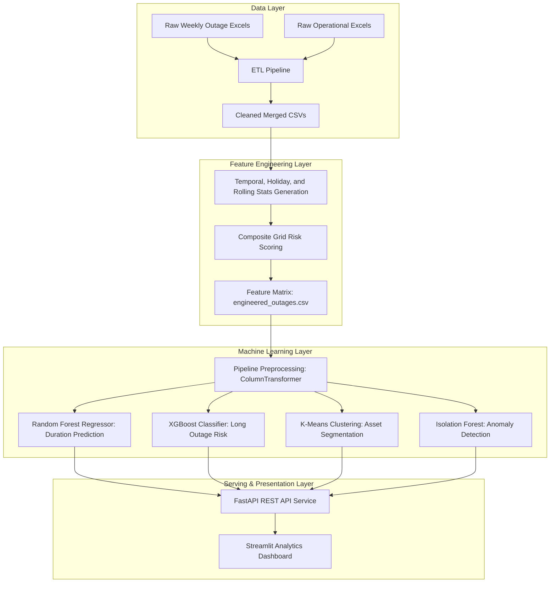

# Terna Grid Outage Analytics & Predictive Maintenance Platform

An enterprise-grade, end-to-end industrial machine learning and analytics platform built on public operational datasets from **Terna**, the Italian electricity transmission system operator (TSO). 

The platform cleanses raw grid maintenance logs, engineers leakage-free rolling features and risk scores, trains four machine learning models, exposes REST API prediction services via FastAPI, and presents an interactive six-page dashboard in Streamlit.

---
Deployed at https://terna-ai-platform-msfn6wl5ifyrq6nulp6t4d.streamlit.app/Asset_Explorer
## 🏗️ System Architecture



---

## 📁 Repository Structure

```text
terna-ai-platform/
├── data/
│   ├── raw/                        # Raw weekly Excel logs (untracked)
│   └── processed/                  # Cleaned merged CSV datasets
├── models/                         # Fitted preprocessing and ML binaries
│   ├── preprocessor.joblib         # Categorical/numerical preprocessor
│   ├── duration_regressor.joblib   # Random Forest outage duration regressor
│   ├── risk_classifier.joblib      # XGBoost risk length classifier
│   ├── asset_clusterer.joblib      # K-Means asset grouping model
│   └── anomaly_detector.joblib     # Isolation Forest anomaly detector
├── notebooks/
│   └── 01_exploratory_data_analysis.ipynb
├── reports/
│   ├── eda_report.md               # Compiler report for statistical insights
│   └── images/                     # Compiled visualization plots (PNGs)
├── src/
│   ├── api/
│   │   ├── main.py                 # FastAPI application and endpoints
│   │   └── schemas.py              # Pydantic validation schemas
│   ├── dashboard/
│   │   ├── app.py                  # Streamlit frontend Overview entry
│   │   └── pages/                  # Multipage dashboard tabs
│   ├── etl/
│   │   └── etl_pipeline.py         # Outage and load files ETL script
│   ├── feature_engineering/
│   │   └── feature_engineering.py  # Mappings, rolling stats, and risk scores
│   └── models/
│   │   └── train_models.py         # Multi-model training and MLflow logging
├── tests/
│   ├── test_api.py                 # API endpoints validation
│   ├── test_etl.py                 # ETL pipeline validation
│   ├── test_features.py            # Feature engineering validation
│   └── test_models.py              # ML model inference validation
├── requirements.txt                # Python package dependencies
└── README.md                       # Documentation overview
```

---

## ⚡ Setup & Installation

### 1. Initialize Virtual Environment
Ensure you have Python 3.10+ installed. Run:
```bash
python -m venv .venv
.venv\Scripts\activate      # On Windows
source .venv/bin/activate    # On Unix/macOS
```

### 2. Install Dependencies
```bash
pip install -r requirements.txt
```

### 3. Run Pipeline Processes
Execute the pipelines sequentially to stage data, extract features, and train the model weights:
```bash
# Run ETL Pipeline
python src/etl/etl_pipeline.py

# Run Feature Engineering
python src/feature_engineering/feature_engineering.py

# Run Model Training & MLflow Registration
python src/models/train_models.py
```

---

## 🚀 Running the Services

The platform runs as a decoupled frontend-backend microservice setup.

### 1. Start FastAPI REST Backend
Start the prediction and query server:
```bash
uvicorn src.api.main:app --host 127.0.0.1 --port 8000
```
*   **API Documentation**: Browse interactive Swagger docs at [http://127.0.0.1:8000/docs](http://127.0.0.1:8000/docs).
*   **Health Check**: [http://127.0.0.1:8000/health](http://127.0.0.1:8000/health).

### 2. Start Streamlit Interactive Dashboard
In a separate terminal window:
```bash
streamlit run src/dashboard/app.py --server.port 8501
```
Open [http://localhost:8501](http://localhost:8501) in your browser.

---

## 🔌 API Endpoints Summary

| Endpoint | Method | Description |
|---|---|---|
| `/health` | `GET` | Server service check. |
| `/predict` | `POST` | Runs a payload through preprocessing and returns duration, risk class, cluster, and anomaly predictions. |
| `/assets` | `GET` | Returns unique grid assets sorted by outages volume or cumulative downtime. |
| `/outages` | `GET` | Paginated list of individual outages filterable by asset type or voltage. |
| `/risk` | `GET` | Top high-risk assets sorted by composite risk scores. |
| `/dashboard` | `GET` | Aggregate KPIs and distributions for the Streamlit cockpit. |
| `/model` | `GET` | ML validation performance metrics. |

---

## 🤖 Machine Learning Model Cockpit

1. **Duration Prediction (Regression)**: Trains a `Random Forest Regressor` to predict непрерывный outage hours (`duration_hours`).
   * *MAE*: 427.80 hours
   * *R² Score*: 0.195
2. **Risk Classification (Classification)**: Trains an `XGBoost Classifier` to predict if an outage will exceed 24 hours (`is_long`).
   * *Accuracy*: 78.0%
   * *F1-Score*: 0.767
   * *ROC-AUC*: 0.865
3. **Asset Clustering**: Fits `K-Means` ($k=3$) to segment maintenance behavioral patterns.
   * *Silhouette Score*: 0.536
4. **Anomaly Detection**: Fits `Isolation Forest` with a 5% expected contamination rate to flag abnormal operational signatures.
   * *Detected Anomalies*: 893 records

---

## 🧪 Running Tests

A comprehensive unit and integration test suite is located in `/tests`. Execute all tests with:
```bash
# Set PYTHONPATH to root directory
$env:PYTHONPATH="."
pytest
```
All tests assert data validation ranges, ensure no data leakage on rolling features, and check API request schemas.
