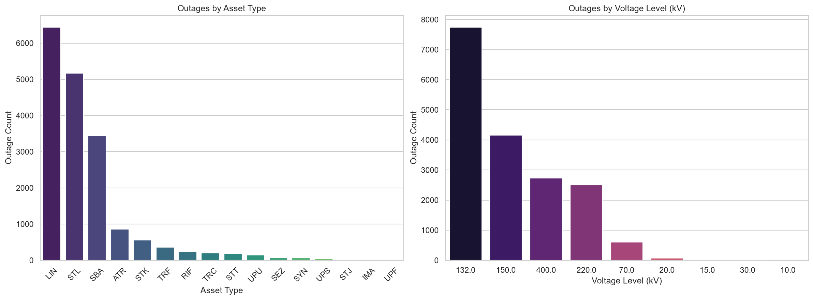
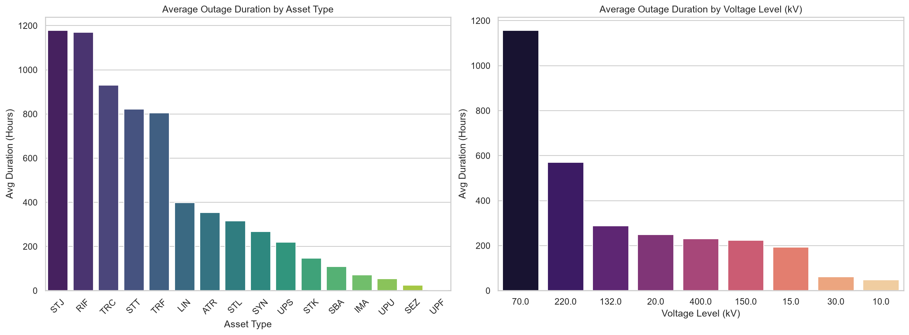
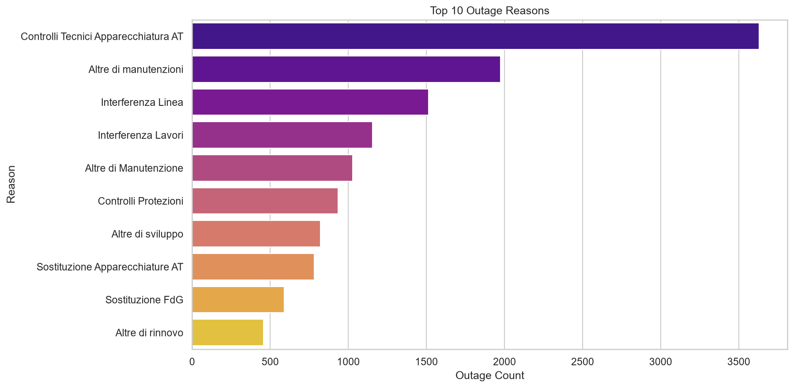
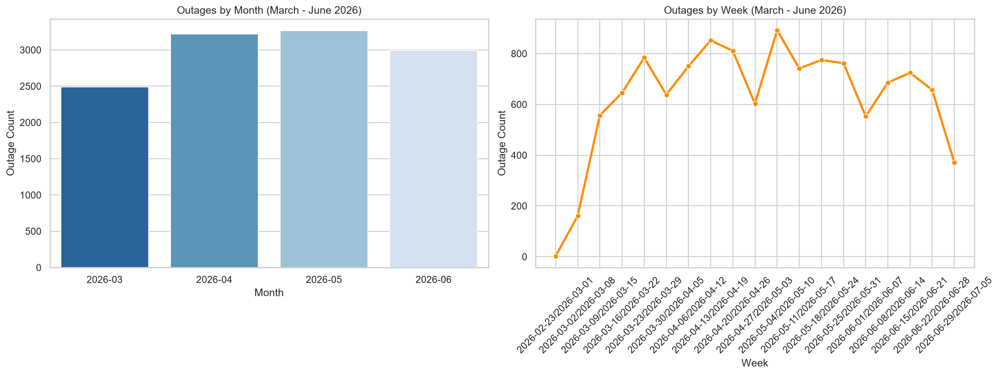
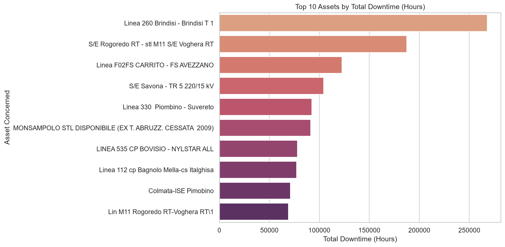
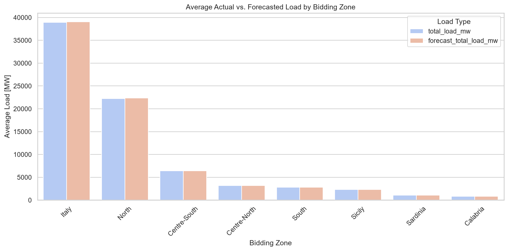
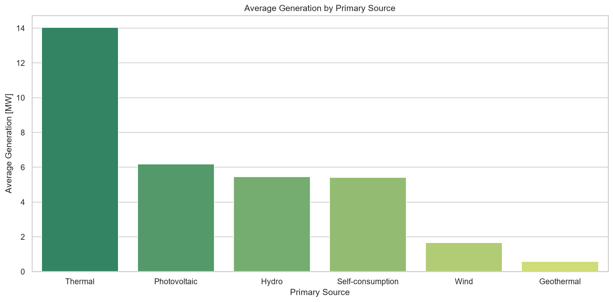
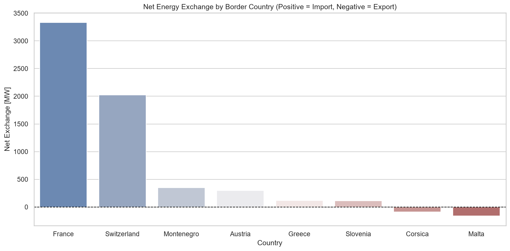
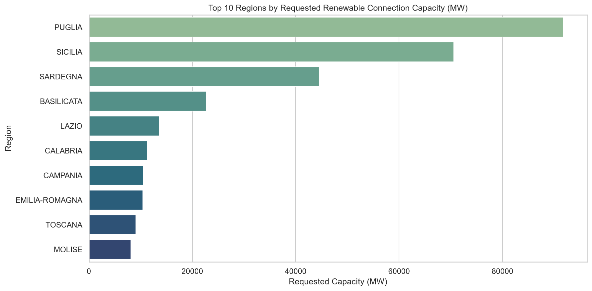

# Terna Grid Operations - Exploratory Data Analysis (EDA) Report

This report presents findings from the Exploratory Data Analysis (EDA) of the Terna transmission grid outages and supplementary grid operational data.

---

## 1. Transmission Grid Outages Analysis

We analyzed the planned transmission outages dataset spanning **March to June 2026**, consisting of **17,846 unique, cleaned outage events** after deduplicating 121,488 weekly reports.

### Outage Frequencies by Asset Type & Voltage Level
The grid assets are represented by code abbreviations:
*   `LIN` = Transmission Lines (*Linea*)
*   `STL` = Bays (*Stallo*)
*   `SBA` = Busbars (*Sbarra*)
*   `ATR` = Autotransformers (*Autotrasformatore*)
*   `STK` = Shunt Reactors / Disconnectors
*   `TRF` = Power Transformers (*Trasformatore*)
*   `RIF` = Shunt Capacitors/Reactors (*Rifasatore*)

#### Key Findings:
*   **Most Common Outage Assets**: Transmission Lines (`LIN`, 6,443 outages) and Bays (`STL`, 5,165 outages) make up the vast majority of planned maintenance events.
*   **Voltage Frequencies**: The `132 kV` network is by far the most frequently under maintenance (7,749 outages), followed by the `150 kV` network (4,152 outages) and the high-voltage `400 kV` (2,735 outages) and `220 kV` (2,500 outages) networks.

### Outage Durations
The duration of outages determines grid downtime and availability.

| Asset Type | Average Duration (Hours) | Maintenance Profile |
| :--- | :--- | :--- |
| **STJ** (Bus Coupler Bay) | 1,179.27 | Long-term capital refurbishment |
| **RIF** (Shunt Capacitor/Reactor) | 1,170.48 | Substation device replacement |
| **TRC** (Regulating Transformer) | 930.24 | Heavy substation overhaul |
| **STT** (Transformer Bay) | 821.42 | High safety check window |
| **TRF** (Power Transformer) | 804.30 | Critical core maintenance |
| **LIN** (Transmission Line) | 398.04 | Standard overhead line servicing |
| **STL** (Standard Bay) | 314.85 | Standard substation bay testing |
| **SBA** (Busbar) | 108.32 | Quick busbar insulation testing |

*   **Autotransformers (`ATR`)** have an average downtime of **352.73 hours**.
*   **Voltage Levels**: While `132 kV` and `150 kV` have the most frequent outages, their average durations are shorter compared to high-voltage backbone outages (e.g. `400 kV` and `220 kV`), which require longer safety margins and more complex maintenance procedures.

### Most Common Outage Reasons
We analyzed the top reasons driving planned outages:
*   **Technical Controls**: *Controlli Tecnici Apparecchiatura AT* is the single largest category (3,631 outages), representing standard technical checks on high-voltage equipment.
*   **Interference**: *Interferenza Linea* (1,513) and *Interferenza Lavori* (1,155) represent outages planned due to external construction work or spatial line interference.
*   **Asset Swaps**: *Sostituzione Apparecchiature AT* (782) and *Sostituzione FdG* (590) denote core equipment replacements.

### Temporal Trends
We analyzed how maintenance schedules align with season/time (March–June 2026):
*   **Monthly Distribution**: May and June see the highest volume of planned outages as weather improves, allowing for safer overhead transmission line servicing.
*   **Weekly Fluctuations**: Outages follow a cyclic weekly pattern, showing that Terna schedules maintenance windows in continuous waves, matching grid demand drops.

### Top 10 Downtime Assets
The individual transmission lines and transformers with the highest total downtime:
1.  **Linea 260 Brindisi - Brindisi T 1**: 268,080 cumulative hours (indicates a long-term decomissioning or permanent outage project).
2.  **S/E Rogoredo RT - stl M11 S/E Voghera RT**: 187,344 hours.
3.  **Linea F02FS CARRITO - FS AVEZZANO**: 122,688 hours.
4.  **S/E Savona - TR 5 220/15 kV**: 104,304 hours.
5.  **Linea 330 Piombino - Suvereto**: 92,376 hours.

---

## 2. Supplementary Grid Operations Analysis

We analyzed the supplementary datasets to capture the wider Italian electricity market context.

### Electricity Demand and Forecast by Bidding Zone
We compared actual total load with forecasted load across Italy's bidding zones:
*   **Load Distribution**: The **North** bidding zone is the primary load center of Italy, consuming several times more power than the southern zones (South, Calabria, Sicily, Sardinia).
*   **Forecast Performance**: The forecast load tracks the actual load very closely in all zones, demonstrating high accuracy in day-ahead load forecasting models.

### Generation by Source
*   **Thermal Dominance**: *Thermal* generation (gas and coal) remains the primary source of baseload power in Italy, accounting for the highest average generation.
*   **Renewable Contribution**: *Hydro*, *Wind*, and *Photovoltaic* (Solar) generation provide substantial capacity, with Solar peaking heavily during daylight hours.

### Cross-border Imports/Exports
*   **Net Importer**: Italy is a net importer of electricity.
*   **Switzerland & France**: The Swiss border (Switzerland) and French border (France) dominate imports, providing key high-voltage AC/DC interconnections to the European grid.
*   **Exports**: Italy exports smaller quantities of power to countries like Greece and Malta.

### Renewable Connection Requests
We analyzed where new renewable projects are waiting to connect:
*   **Regional Concentration**: **Puglia**, **Sicilia**, and **Sardegna** lead Italy in requested renewable connection capacity (MW). These regions have the highest solar radiation and wind potential.
*   **Grid Bottlenecks**: The heavy concentration of requests in the South (Puglia, Sicily) poses a significant challenge for Terna, as the major consumption center is in the North. This mismatch highlights why transmission maintenance and capacity upgrades are vital.

